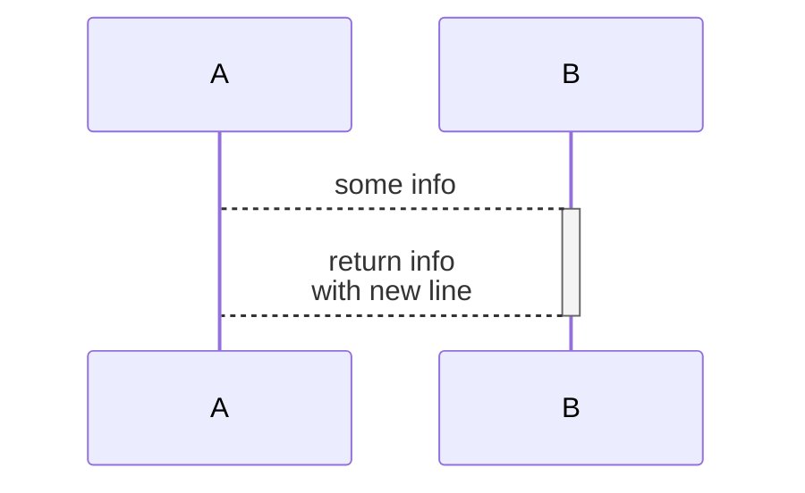

# MERMAID
- official: https://mermaid.js.org/
- official source(github) - https://github.com/mermaid-js/mermaid
- decent cheat: https://jojozhuang.github.io/tutorial/mermaid-cheat-sheet/ 
- github renders mermaid code blocks in markdown! 💛 - https://github.blog/2022-02-14-include-diagrams-markdown-files-mermaid/

## TOOLS
- mermaid CLI - https://github.com/mermaid-js/mermaid-cli
    - convert mermaid source to svg/png/pdf
    - convert mermaid source embedded in markdown
- web live editor - https://mermaid.live/

## FLOW CHART

## SEQUENCE DIAGRAM
- the `theme` value of `null` looks best on both light and dark modes
    - `forest`, `default`, `base` have light lines/arrow/messages in dark mode, `dark` doesnt look good in light mode

