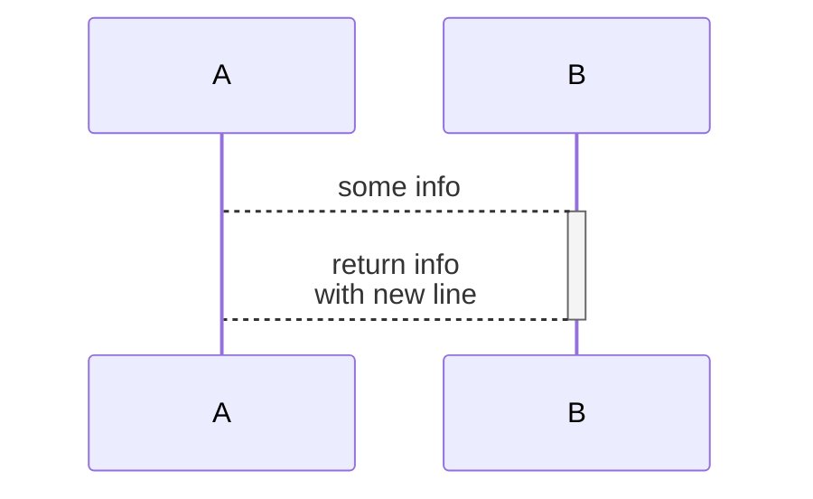

# DIAGRAM CHEATSHEET

## WHITEBOARDING
- https://witeboard.com/
- https://webwhiteboard.com/

## MERMAID
- official: https://mermaid.js.org/
- official source(github) - https://github.com/mermaid-js/mermaid
- decent cheat: https://jojozhuang.github.io/tutorial/mermaid-cheat-sheet/ 
- github renders mermaid code blocks in markdown! 💛 - https://github.blog/2022-02-14-include-diagrams-markdown-files-mermaid/
### TOOLS
- mermaid CLI - https://github.com/mermaid-js/mermaid-cli
    - convert mermaid source to svg/png/pdf
    - convert mermaid source embedded in markdown
- web live editor - https://mermaid.live/
### FLOW CHART

### SEQUENCE DIAGRAM
- the `theme` value of `null` looks best on both light and dark modes
    - `forest`, `default`, `base` have light lines/arrow/messages in dark mode, `dark` doesnt look good in light mode

## PLANTUML
- https://github.com/plantuml/plantuml
- https://plantuml.com/
- can do ascii diagrams! - https://plantuml.com/ascii-art
- far more sophisticated in features than mermaid

## ASCII
- [asciio](https://metacpan.org/dist/App-Asciio/view/lib/App/Asciio.pm)
- drawit vim plugin: https://www.thegeekstuff.com/2009/12/how-to-create-ascii-drawings-in-vim-editor-draw-boxes-lines-ellipses-arrows-inside-text-file/#more-2732
- asciiflow - https://asciiflow.com/
- [monodraw](https://monodraw.helftone.com/) - sophisticated by not free, mac only
