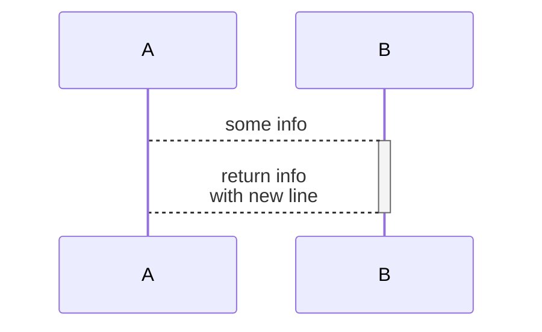

# MERMAID
- official: https://mermaid.js.org/
- decent cheat: https://jojozhuang.github.io/tutorial/mermaid-cheat-sheet/ 
- github renders mermaid code blocks! 💛 - https://github.blog/2022-02-14-include-diagrams-markdown-files-mermaid/

## FLOW CHART

## SEQUENCE DIAGRAM

